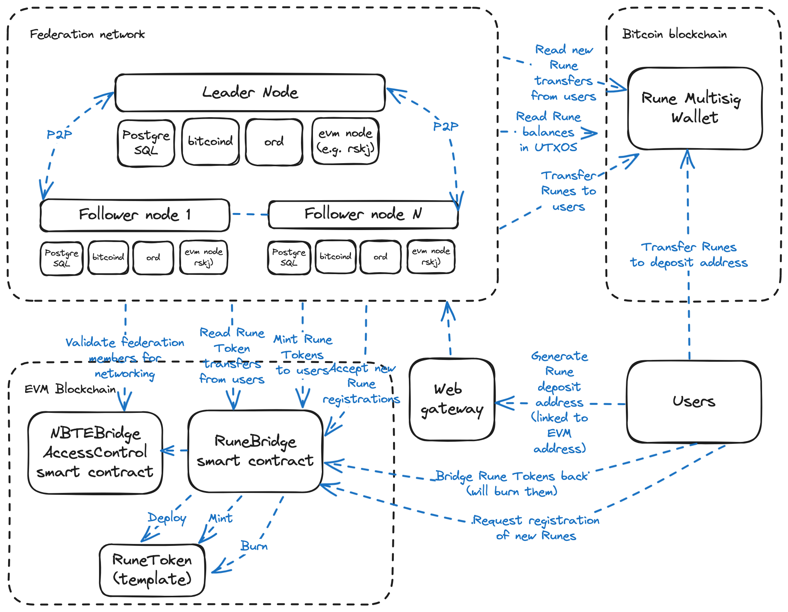

Sovryn Rune Bridge
==================

The Sovryn Rune Bridge is a bridge from [Runes](https://github.com/ordinals/ord/blob/master/docs/src/runes.md) to EVM
compatible blockchains (such as RSK) and back. It is a part of the Sovryn NBTE Bridge project (where NBTE stands for New
Bitcoin Token Economy).

## Bridge architecture

The bridge consists of:

- A federation network of N nodes, where a strict majority has to agree for all
- A set of smart contracts on an EVM-compatible blockchain
- A multisig wallet on the Bitcoin network that holds Rune and Bitcoin balances

### The federation network

The federation network consists of the leader node and a group of follower nodes. All nodes are responsible for
reading and validating data (like user transfers) from the blockchains. The leader node is responsible
for initiating new transfers to users and asking signatures from multisig transfers. The follower nodes are responsible
for validating the requests from the leader node, and providing said signatures. The nodes communicate with each other
off-chain, over P2P.

Each node has its own EVM private key and Bitcoin xpriv master private key.

All nodes share the same codebase (`bridge_node`).

In addition, there exists a Web Gateway that will provide a RESTful API for users to the network,
for the purpose of asking deposits addresses.

### Bitcoin multisig

The Bitcoin multisig is a standard P2WSH (might be later changed to P2TR) multisig wallet, where signatures
from the majority of multisig signers are required to transfer funds.

The xprivs of each node are used to construct the multisig, which means it's possible to generate derive
an infinite amount of addresses for it. A new deposit address will be derived for each user (EVM address)
that asks for an address from the wallet using the Web Gateway. The federation network will detect transfers
of (registered) Runes to these addresses and initiate minting of Rune Tokens to the users.

Bitcoin Core doesn't directly support the Runes protocol -- hence logic related to constructing valid
Rune transfers is implemented in the backend code.

Data related to Runes is read from the `ord` server.

### EVM Smart Contracts

The EVM smart contracts consist of the following contracts:

- `RuneBridge`: The main contract. See below for use cases
- `NBTEBridgeAccessControl`: Keeps track of federators and admins for all NBTE Bridge contracts in a chain.
- `RuneToken`: A "side token" contract, an instance of which will get deployed for each registered Rune
- Various utility contracts, as needed

Users use the `RuneBridge` contract for the following purposes:

- Bridge Rune Tokens back to runes. This burns the Rune Tokens and emits an event, which the federation
  network will see and initiate Rune transfers to users.
- Request registration of new Runes. This emits an event which will be seen by the federation network,
  and if the details of the registration are valid, the network initiate a transaction which will deploy
  a Rune Token for that rune and enable transferring the Rune.

The federation network uses the `RuneBridge` contract for the following purposes:

- Mint new Rune Tokens to users, when transfers to Rune deposit addresses are detected in the Bitcoin network
- Accept Rune Registration requests.

